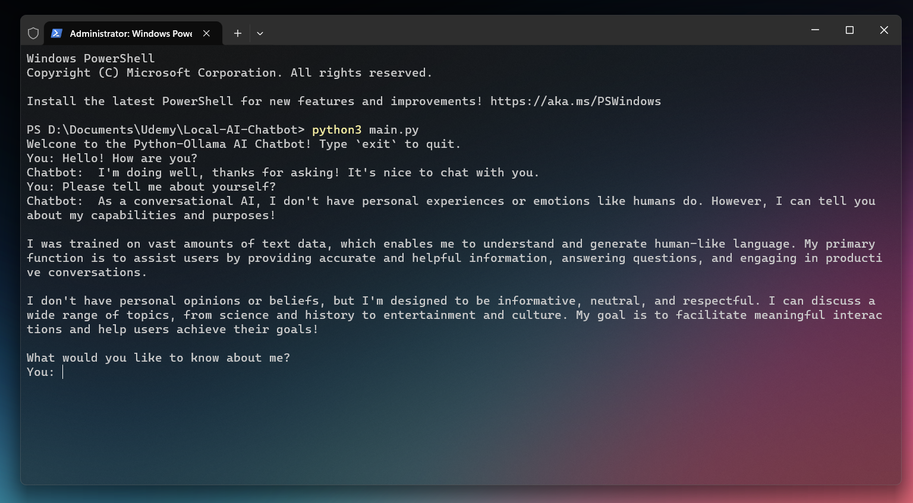

# AI Chatbot using Python and Ollama

**This project implements an AI-powered chatbot using Ollama and large language models. It allows users to interact with various AI models through a simple Python interface.**

 

**Please click the thumbnail for a preview. 👇**

 

**Prerequisites**

    - Python 3.7+
    - Ollama

**Usage**

1. Install Ollama by following the instructions in the <a href= "https://github.com/ollama/ollama" targe= "_blank">official Ollama repository.</a>

2. Clone this repository.

3. Run the `main.py` script.

4. You can now interact with the AI model by typing your message and pressing Enter.

5. To exit, type `exit` and click Enter.

 

**Features**

- Seamless integration with Ollama for running AI models locally

- Support for multiple language models (e.g., Llama 3, Gemma)

- Simple and intuitive chat interface

 

**Customization**
 
- You can customize the models by changing the `model` parameter in the `OllamaLLM` function or simply typing `change model` mid-chat.

 

**Contributions are welcome! Please feel free to submit a Pull Request.**
